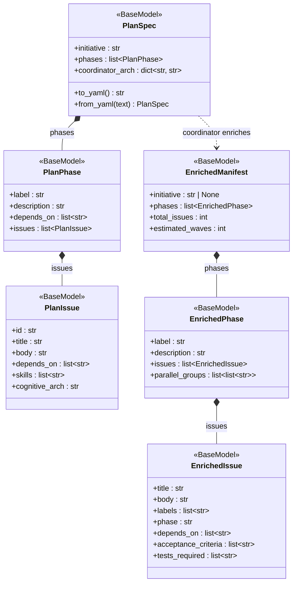
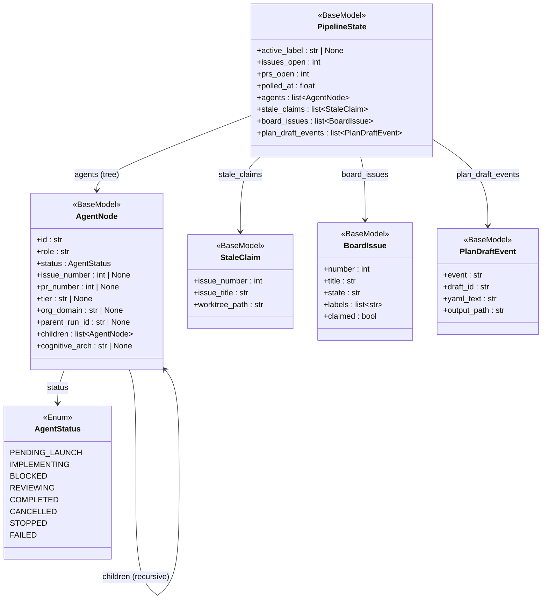
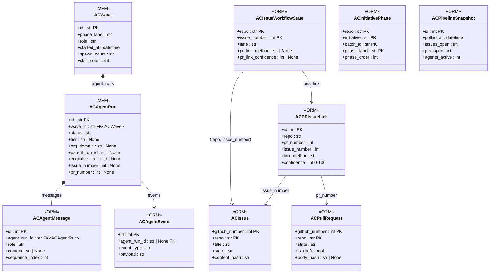
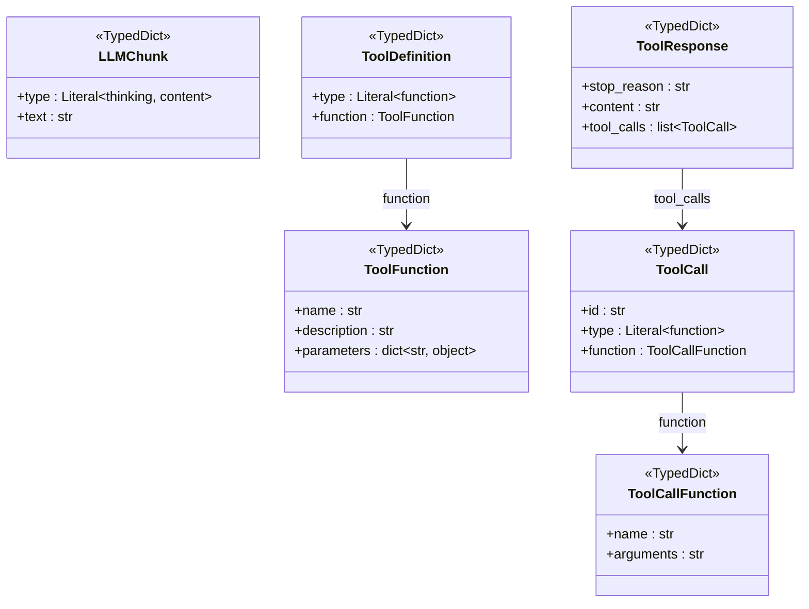
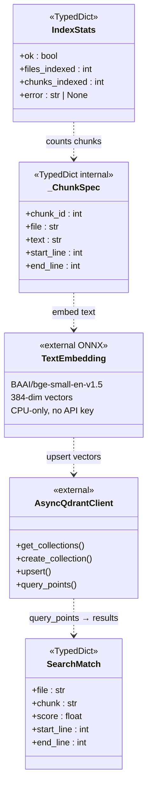
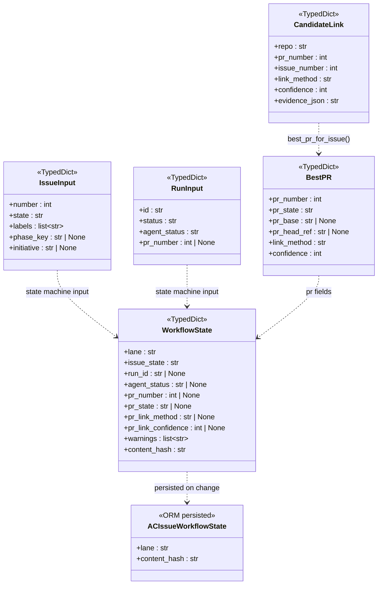
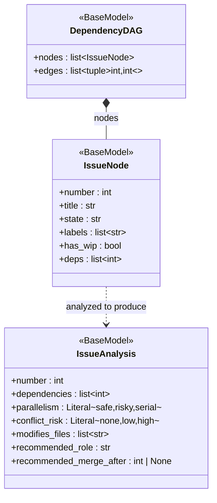
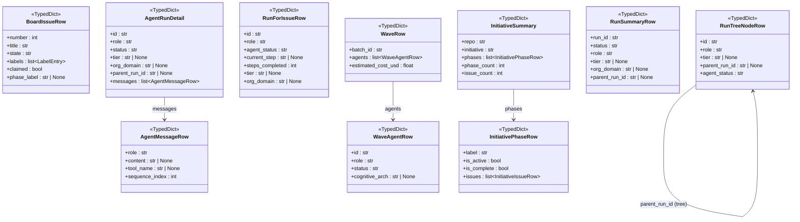

# AgentCeption — Type Contracts Reference

> Updated: 2026-03-06 | Reflects the full entity surface after the Cursor-free agent loop, Qdrant code indexing, API key authentication, and workflow state machine additions. `Any` does not exist in any production file. Every type boundary is named.

This document is the single source of truth for every named entity (TypedDict, Pydantic BaseModel, SQLAlchemy ORM class, Enum) in the AgentCeption codebase. It covers the full contract of each type: fields, types, optionality, and intended use.

---

## Table of Contents

1. [Design Philosophy](#design-philosophy)
2. [Domain Models (`agentception/models/`)](#domain-models)
   - [Agent Lifecycle](#agent-lifecycle)
   - [Pipeline State](#pipeline-state)
   - [Task File](#task-file)
   - [Pipeline Configuration](#pipeline-configuration)
   - [Spawn API](#spawn-api)
   - [Role Studio API](#role-studio-api)
   - [Cognitive Architecture API](#cognitive-architecture-api)
   - [Template API](#template-api)
   - [Org Tree](#org-tree)
   - [PlanSpec — YAML Contract](#planspec--yaml-contract)
   - [EnrichedManifest — Coordinator Contract](#enrichedmanifest--coordinator-contract)
3. [Health Model](#health-model)
4. [ORM Models (`agentception/db/models.py`)](#orm-models)
5. [Query TypedDicts (`agentception/db/queries.py`)](#query-typeddicts)
   - [Issue and PR Rows](#issue-and-pr-rows)
   - [Agent Run Rows](#agent-run-rows)
   - [Wave and Conductor Rows](#wave-and-conductor-rows)
   - [Phase and Board Rows](#phase-and-board-rows)
   - [Workflow and Dispatch Rows](#workflow-and-dispatch-rows)
   - [MCP Query Rows](#mcp-query-rows)
6. [LLM Service Types (`agentception/services/llm.py`)](#llm-service-types)
7. [Code Indexer Types (`agentception/services/code_indexer.py`)](#code-indexer-types)
8. [MCP Protocol Types (`agentception/mcp/types.py`)](#mcp-protocol-types)
9. [Workflow Types](#workflow-types)
   - [State Machine (`workflow/state_machine.py`)](#state-machine)
   - [Link Discovery (`workflow/linking.py`)](#link-discovery)
10. [Intelligence Types](#intelligence-types)
11. [Entity Hierarchy](#entity-hierarchy)
12. [Entity Graphs (Mermaid)](#entity-graphs-mermaid)

---

## Design Philosophy

Every entity in this codebase follows four rules:

1. **No `Any`. Ever.** `Any` collapses type safety for all downstream callers. Every boundary is typed with a concrete named entity — `TypedDict`, `BaseModel`, `Protocol`, or a specific union.

2. **Boundaries own coercion.** When external data arrives (JSON from GitHub, DB rows, TOML files), the boundary module coerces it to the canonical internal type. Downstream code always sees clean types.

3. **TypedDicts for read-only query results, Pydantic for validated I/O.** DB query functions return `TypedDict` rows — plain, fast, no validation overhead. HTTP request/response bodies and pipeline config use Pydantic `BaseModel` so validation errors surface at the boundary with clear messages.

4. **ORM models stay in `db/`.** SQLAlchemy `Base` subclasses never cross into `routes/` or `services/`. They are converted to `TypedDict` rows by query functions in `db/queries.py`.

### What to use instead

| Banned | Use instead |
|--------|-------------|
| `Any` | `TypedDict`, `BaseModel`, specific union |
| `object` | The actual type or a constrained union |
| `list` (bare) | `list[X]` with concrete element type |
| `dict` (bare) | `dict[K, V]` with concrete key/value types |
| `dict[str, X]` with known keys | `TypedDict` or `BaseModel` |
| `cast(T, x)` | Fix the callee to return `T` |
| `# type: ignore` | Fix the underlying type error |

---

## Domain Models

**Path:** `agentception/models/__init__.py`

All Pydantic `BaseModel` subclasses. Wire format is snake_case throughout.

### Agent Lifecycle

#### `AgentStatus`

`str, Enum` — Lifecycle state of a single pipeline agent.

| Value | Meaning |
|-------|---------|
| `"pending_launch"` | Worktree created, Cursor task not yet started |
| `"implementing"` | Agent is actively writing code |
| `"blocked"` | Agent reported a blocker via MCP |
| `"reviewing"` | PR open, awaiting review |
| `"completed"` | PR merged; work done |
| `"cancelled"` | Run explicitly cancelled |
| `"stopped"` | Run stopped (agent stopped itself) |
| `"failed"` | Run failed with an error |

#### `AgentNode`

`BaseModel` — A single agent in the pipeline tree, for the Build dashboard.

| Field | Type | Default | Description |
|-------|------|---------|-------------|
| `id` | `str` | required | Worktree basename or UUID |
| `role` | `str` | required | Role slug (e.g. `"python-developer"`) |
| `status` | `AgentStatus` | required | Current lifecycle state |
| `issue_number` | `int \| None` | `None` | GitHub issue being worked |
| `pr_number` | `int \| None` | `None` | GitHub PR opened by this agent |
| `branch` | `str \| None` | `None` | Git branch name |
| `batch_id` | `str \| None` | `None` | Batch this run belongs to |
| `worktree_path` | `str \| None` | `None` | Container-side worktree path |
| `transcript_path` | `str \| None` | `None` | Path to Cursor transcript |
| `message_count` | `int` | `0` | Number of transcript messages |
| `last_activity_mtime` | `float` | `0.0` | File mtime of last transcript write |
| `children` | `list[AgentNode]` | `[]` | Sub-agents spawned by this agent |
| `cognitive_arch` | `str \| None` | `None` | Arch string (e.g. `"feynman:python"`) |
| `tier` | `str \| None` | `None` | `"coordinator"` \| `"worker"` |
| `org_domain` | `str \| None` | `None` | `"c-suite"` \| `"engineering"` \| `"qa"` |
| `parent_run_id` | `str \| None` | `None` | Run ID of spawning agent |

#### `StaleClaim`

`BaseModel` — A GitHub issue with `agent/wip` label but no local worktree.

| Field | Type | Description |
|-------|------|-------------|
| `issue_number` | `int` | GitHub issue number |
| `issue_title` | `str` | Issue title |
| `worktree_path` | `str` | Expected path that does not exist |

### Pipeline State

#### `BoardIssue`

`BaseModel` — Lightweight issue summary for the overview board sidebar.

| Field | Type | Default | Description |
|-------|------|---------|-------------|
| `number` | `int` | required | GitHub issue number |
| `title` | `str` | required | Issue title |
| `state` | `str` | `"open"` | `"open"` or `"closed"` |
| `labels` | `list[str]` | `[]` | Label name strings |
| `claimed` | `bool` | `False` | Whether `agent/wip` label is set |
| `phase_label` | `str \| None` | `None` | Active phase label at last sync |
| `last_synced_at` | `str \| None` | `None` | ISO-8601 UTC timestamp |

#### `PlanDraftEvent`

`BaseModel` — A plan-draft lifecycle event emitted by the poller.

| Field | Type | Default | Description |
|-------|------|---------|-------------|
| `event` | `str` | required | `"plan_draft_ready"` \| `"plan_draft_timeout"` |
| `draft_id` | `str` | required | Stable draft identifier |
| `yaml_text` | `str` | `""` | Raw YAML (filled for `plan_draft_ready`) |
| `output_path` | `str` | required | Absolute path of the output file |

#### `PipelineState`

`BaseModel` — Snapshot of the entire pipeline at a point in time. Served to the dashboard via SSE.

| Field | Type | Default | Description |
|-------|------|---------|-------------|
| `active_label` | `str \| None` | required | Currently active phase label |
| `issues_open` | `int` | required | Count of open GitHub issues |
| `prs_open` | `int` | required | Count of open GitHub PRs |
| `agents` | `list[AgentNode]` | required | All live agent nodes (tree) |
| `alerts` | `list[str]` | `[]` | Human-readable alert strings |
| `stale_claims` | `list[StaleClaim]` | `[]` | Issues with dangling `agent/wip` labels |
| `board_issues` | `list[BoardIssue]` | `[]` | Unclaimed issues for the active phase |
| `polled_at` | `float` | required | UNIX timestamp of this snapshot |
| `closed_issues_count` | `int` | `0` | Issues closed in the last 24 hours |
| `merged_prs_count` | `int` | `0` | PRs merged in the last 24 hours |
| `stale_branches` | `list[str]` | `[]` | Local branches without a live worktree |
| `pending_approval` | `list[dict[str, object]]` | `[]` | Issues awaiting human approval |
| `plan_draft_events` | `list[PlanDraftEvent]` | `[]` | New plan-draft events for this tick |

### Task File

#### `IssueSub`

`BaseModel` — One entry from `[[issue_queue]]` in a TOML `.agent-task` file.

| Field | Type | Default |
|-------|------|---------|
| `number` | `int` | required |
| `title` | `str` | `""` |
| `role` | `str` | `""` |
| `cognitive_arch` | `str` | `""` |
| `depends_on` | `list[int]` | `[]` |
| `file_ownership` | `list[str]` | `[]` |
| `branch` | `str \| None` | `None` |

#### `PRSub`

`BaseModel` — One entry from `[[pr_queue]]` in a TOML `.agent-task` file.

| Field | Type | Default |
|-------|------|---------|
| `number` | `int` | required |
| `title` | `str` | `""` |
| `branch` | `str` | `""` |
| `role` | `str` | `""` |
| `cognitive_arch` | `str` | `""` |
| `grade_threshold` | `str` | `""` |
| `merge_order` | `int` | `0` |
| `closes_issues` | `list[int]` | `[]` |

#### `TaskFile`

`BaseModel` — Parsed content of a `.agent-task` TOML file. All fields optional for lenient parsing.

| Section | Field | Type | Default | Description |
|---------|-------|------|---------|-------------|
| `[task]` | `task` | `str \| None` | `None` | Task description |
| | `id` | `str \| None` | `None` | Task identifier |
| | `attempt_n` | `int` | `0` | Attempt number |
| | `is_resumed` | `bool` | `False` | Whether this is a resumed task |
| | `required_output` | `str \| None` | `None` | Output requirement |
| | `on_block` | `str \| None` | `None` | Block handler instruction |
| `[agent]` | `role` | `str \| None` | `None` | Role slug |
| | `tier` | `str \| None` | `None` | `"coordinator"` \| `"worker"` |
| | `org_domain` | `str \| None` | `None` | `"c-suite"` \| `"engineering"` \| `"qa"` |
| | `cognitive_arch` | `str \| None` | `None` | Arch string |
| | `session_id` | `str \| None` | `None` | Cursor session ID |
| `[repo]` | `gh_repo` | `str \| None` | `None` | `owner/name` |
| | `base` | `str \| None` | `None` | Base branch |
| `[pipeline]` | `batch_id` | `str \| None` | `None` | Wave batch identifier |
| | `parent_run_id` | `str \| None` | `None` | Spawning agent's run ID |
| | `wave` | `str \| None` | `None` | Wave identifier |
| `[spawn]` | `spawn_sub_agents` | `bool` | `False` | Whether to spawn children |
| | `spawn_mode` | `str \| None` | `None` | Spawn mode string |
| `[target]` | `issue_number` | `int \| None` | `None` | Target GitHub issue |
| | `pr_number` | `int \| None` | `None` | Target GitHub PR |
| | `depends_on` | `list[int]` | `[]` | Dependency issue numbers |
| `[worktree]` | `branch` | `str \| None` | `None` | Git branch name |
| Queues | `issue_queue` | `list[IssueSub]` | `[]` | Issues to spawn |
| | `pr_queue` | `list[PRSub]` | `[]` | PRs to review |

### Pipeline Configuration

#### `AbModeConfig`

`BaseModel` — A/B mode configuration for role file experimentation.

| Field | Type | Default | Description |
|-------|------|---------|-------------|
| `enabled` | `bool` | `False` | Whether A/B mode is active |
| `target_role` | `str \| None` | `None` | Role slug being experimented on |
| `variant_a_file` | `str \| None` | `None` | Path to variant A role file |
| `variant_b_file` | `str \| None` | `None` | Path to variant B role file |

#### `ProjectConfig`

`BaseModel` — A single project entry in `pipeline-config.json`.

| Field | Type | Default | Description |
|-------|------|---------|-------------|
| `name` | `str` | required | Display name for the project |
| `gh_repo` | `str` | required | GitHub `owner/repo` string |
| `repo_dir` | `str \| None` | `None` | Override for the local repo path |
| `worktrees_dir` | `str \| None` | `None` | Override for worktrees directory |
| `cursor_project_id` | `str \| None` | `None` | Cursor project slug for transcripts |

#### `PipelineConfig`

`BaseModel` — Validated shape of `.agentception/pipeline-config.json`.

| Field | Type | Default | Description |
|-------|------|---------|-------------|
| `coordinator_limits` | `dict[str, int]` | `{"engineering-coordinator": 1, "qa-coordinator": 1}` | Max concurrent coordinator instances |
| `pool_size` | `int` | `4` | Leaf agents per coordinator |
| `active_labels_order` | `list[str]` | `[]` | Ordered phase labels for auto-advance |
| `ab_mode` | `AbModeConfig` | `AbModeConfig()` | A/B experimentation config |
| `projects` | `list[ProjectConfig]` | `[]` | All configured projects |
| `active_project` | `str \| None` | `None` | Name of the active project |
| `approval_required_labels` | `list[str]` | `["db-schema", "security", "api-contract"]` | Labels that trigger approval gate |
| `phase_advance_blocked_label` | `str` | `"pipeline/gated"` | Label removed on phase advance |
| `phase_advance_active_label` | `str` | `"pipeline/active"` | Label added on phase advance |

### Spawn API

#### `SpawnRequest` / `SpawnResult`

| Model | Field | Type | Description |
|-------|-------|------|-------------|
| `SpawnRequest` | `issue_number` | `int` | Issue to work on |
| | `role` | `str` | Role slug (validated against taxonomy) |
| `SpawnResult` | `spawned` | `int` | Issue number that was spawned |
| | `worktree` | `str` | Container-side worktree path |
| | `host_worktree` | `str` | Host-side path for Cursor |
| | `branch` | `str` | Git branch name |
| | `agent_task` | `str` | Raw `.agent-task` file content |
| | `spawned_at` | `str` | ISO-8601 UTC timestamp |

#### `SpawnConductorRequest` / `SpawnConductorResult`

| Model | Field | Type | Description |
|-------|-------|------|-------------|
| `SpawnConductorRequest` | `phases` | `list[str]` | Phase labels to conduct |
| | `org` | `str \| None` | Org scope override |
| `SpawnConductorResult` | `wave_id` | `str` | Generated conductor ID |
| | `worktree` | `str` | Container-side path |
| | `host_worktree` | `str` | Host-side path |
| | `branch` | `str` | Git branch |
| | `agent_task` | `str` | Task file content |

#### `SpawnCoordinatorRequest` / `SpawnCoordinatorResult`

| Model | Field | Type | Description |
|-------|-------|------|-------------|
| `SpawnCoordinatorRequest` | `plan_text` | `str` | Free-form planning text |
| | `label_prefix` | `str` | Phase label prefix |
| `SpawnCoordinatorResult` | `slug` | `str` | Worktree directory name |
| | `worktree` | `str` | Container-side path |
| | `host_worktree` | `str` | Host-side path |
| | `branch` | `str` | Git branch |
| | `agent_task` | `str` | Task file content |

### Role Studio API

#### Role file models

| Model | Key Fields | Description |
|-------|------------|-------------|
| `RoleMeta` | `slug`, `path`, `line_count`, `mtime`, `last_commit_sha` | File metadata without content |
| `RoleContent` | `slug`, `content`, `meta: RoleMeta` | Full file with metadata — `GET /api/roles/{slug}` |
| `RoleUpdateRequest` | `content: str` | Request body for `PUT /api/roles/{slug}` |
| `RoleUpdateResponse` | `slug`, `diff`, `meta: RoleMeta` | Diff and refreshed metadata |
| `RoleDiffRequest` | `content: str` | Proposed content for preview |
| `RoleDiffResponse` | `slug`, `diff` | Unified diff vs HEAD |
| `RoleCommitRequest` | `content: str` | Content to write and commit |
| `RoleCommitResponse` | `slug`, `commit_sha`, `message` | Resulting git SHA |
| `RoleVersionEntry` | `sha`, `label`, `timestamp: int` | One version in history |
| `RoleVersionInfo` | `current: str`, `history: list[RoleVersionEntry]` | Version tracking data |
| `RoleVersionsResponse` | `slug`, `versions: RoleVersionInfo` | `GET /api/roles/{slug}/versions` |

### Cognitive Architecture API

#### `TaxonomyRole`

`BaseModel` — Single role from the org hierarchy taxonomy.

| Field | Type | Description |
|-------|------|-------------|
| `slug` | `str` | Role identifier |
| `label` | `str` | Display name |
| `title` | `str` | Job title |
| `category` | `str` | Role category |
| `description` | `str` | Role description |
| `spawnable` | `bool` | Whether directly spawnable |
| `compatible_figures` | `list[str]` | Compatible persona slugs |
| `compatible_skill_domains` | `list[str]` | Compatible skill IDs |
| `file_exists` | `bool` | Whether role Markdown file exists |

#### `TaxonomyLevel`

`BaseModel` — One tier of the org hierarchy.

| Field | Type | Description |
|-------|------|-------------|
| `id` | `str` | Tier identifier |
| `label` | `str` | Display name (e.g. `"C-Suite"`) |
| `description` | `str` | Tier description |
| `roles` | `list[TaxonomyRole]` | All roles in this tier |

**`TaxonomyResponse`**: `levels: list[TaxonomyLevel]` — `GET /api/roles/taxonomy`.

#### `PersonaEntry`

`BaseModel` — A single historical/industry figure from the cognitive arch library.

| Field | Type | Description |
|-------|------|-------------|
| `id` | `str` | Figure slug (e.g. `"feynman"`) |
| `display_name` | `str` | Display name |
| `layer` | `str` | Arch layer (`"figures"`) |
| `extends` | `str` | Parent archetype slug |
| `description` | `str` | Short description |
| `prompt_prefix` | `str` | Injected context block at spawn |
| `overrides` | `dict[str, str]` | Atom dimension overrides |

**`PersonasResponse`**: `personas: list[PersonaEntry]` — `GET /api/roles/personas`.

#### Atom models

| Model | Fields | Description |
|-------|--------|-------------|
| `AtomValue` | `id`, `label`, `description` | One value within a dimension |
| `AtomDimension` | `dimension`, `description`, `values: list[AtomValue]` | One cognitive atom |
| `AtomsResponse` | `atoms: list[AtomDimension]` | `GET /api/roles/atoms` |

### Template API

| Model | Key Fields | Description |
|-------|------------|-------------|
| `TemplateExportRequest` | `name`, `version` | Request to export a template |
| `TemplateManifest` | `name`, `version`, `created_at`, `gh_repo`, `files: list[str]` | Archive metadata |
| `TemplateConflict` | `path`, `exists: bool` | File conflict during import |
| `TemplateImportResult` | `name`, `version`, `extracted: list[str]`, `conflicts: list[TemplateConflict]` | Import result |
| `TemplateListEntry` | `filename`, `name`, `version`, `created_at`, `gh_repo`, `size_bytes: int` | Archive listing |

### Org Tree

#### `OrgTreeRole`

`BaseModel` — A role entry in the org tree.

| Field | Type | Description |
|-------|------|-------------|
| `slug` | `str` | Role identifier |
| `name` | `str` | Display name |
| `tier` | `str` | `"c-suite"` \| `"coordinator"` \| `"worker"` |
| `assigned_phases` | `list[str]` | Phase labels assigned to this role |
| `figures` | `list[str]` | First two compatible figure slugs |

#### `OrgTreeNode`

`BaseModel` — One node in the D3 org tree (recursive).

| Field | Type | Description |
|-------|------|-------------|
| `name` | `str` | Display name |
| `id` | `str` | Node identifier |
| `tier` | `str` | Tier label |
| `roles` | `list[OrgTreeRole]` | Role cards at this level |
| `children` | `list[OrgTreeNode]` | Sub-nodes (recursive) |

### PlanSpec — YAML Contract

The typed YAML contract between Phase 1A (LLM planner) and Phase 1B (human review).

#### `PlanIssue`

`BaseModel` — A single GitHub issue to be created.

| Field | Type | Default | Description |
|-------|------|---------|-------------|
| `id` | `str` | required | Stable kebab-case slug (e.g. `"auth-001"`) |
| `title` | `str` | required | Issue title |
| `body` | `str` | required | Markdown body |
| `depends_on` | `list[str]` | `[]` | Issue IDs (not titles) this issue depends on |
| `skills` | `list[str]` | `[]` | Skill domain IDs from cognitive arch catalog |
| `cognitive_arch` | `str` | `""` | Resolved arch string (`"figure:skill1[:skill2]"`) |

#### `PlanPhase`

`BaseModel` — A sequenced phase grouping related issues.

| Field | Type | Default | Description |
|-------|------|---------|-------------|
| `label` | `str` | required | Phase label — must match `^[0-9]+-[a-z0-9][a-z0-9-]*$` |
| `description` | `str` | required | One-sentence gate criterion |
| `depends_on` | `list[str]` | `[]` | Phase labels that must complete first |
| `issues` | `list[PlanIssue]` | required | Non-empty list of issues |

#### `PlanSpec`

`BaseModel` — Root schema for the plan-step-v2 YAML contract.

| Field | Type | Default | Description |
|-------|------|---------|-------------|
| `initiative` | `str` | required | Short slug (e.g. `"auth-rewrite"`) |
| `phases` | `list[PlanPhase]` | required | Non-empty; phase 0 has no deps |
| `coordinator_arch` | `dict[str, str]` | `{}` | Maps coordinator role slugs to arch strings |

**Invariants:** phases non-empty; phase `depends_on` DAG (no forward refs, no cycles); issue IDs globally unique; issue `depends_on` references valid IDs.

**Serialization:** `to_yaml() -> str` / `from_yaml(text: str) -> PlanSpec`.

### EnrichedManifest — Coordinator Contract

Produced by the LLM coordinator after enriching a `PlanSpec` with full issue bodies and metadata.

#### `EnrichedIssue`

`BaseModel` — A fully-specified GitHub issue with acceptance criteria.

| Field | Type | Default | Description |
|-------|------|---------|-------------|
| `title` | `str` | required | Issue title |
| `body` | `str` | required | Markdown body |
| `labels` | `list[str]` | required | GitHub label strings |
| `phase` | `str` | required | Phase label |
| `depends_on` | `list[str]` | `[]` | Issue *titles* that must merge first |
| `can_parallel` | `bool` | `True` | Whether safe to run concurrently |
| `acceptance_criteria` | `list[str]` | required | Completion criteria |
| `tests_required` | `list[str]` | required | Required test scenarios |
| `docs_required` | `list[str]` | required | Required doc updates |

#### `EnrichedPhase`

`BaseModel` — A sequenced phase in an `EnrichedManifest`.

| Field | Type | Default | Description |
|-------|------|---------|-------------|
| `label` | `str` | required | Phase slug |
| `description` | `str` | required | Gate criterion |
| `depends_on` | `list[str]` | `[]` | Phase labels that must complete first |
| `issues` | `list[EnrichedIssue]` | required | Issues in this phase |
| `parallel_groups` | `list[list[str]]` | required | Concurrent execution groups by title |

#### `EnrichedManifest`

`BaseModel` — Root coordinator input contract.

| Field | Type | Description |
|-------|------|-------------|
| `initiative` | `str \| None` | Initiative slug |
| `phases` | `list[EnrichedPhase]` | Non-empty phase list |
| `total_issues` | `int` | Computed: `sum(len(p.issues) for p in phases)` |
| `estimated_waves` | `int` | Computed: critical-path length through dep graph |

---

## Health Model

**Path:** `agentception/models/health.py`

#### `HealthSnapshot`

`BaseModel` — Point-in-time system health metrics. Returned by `GET /api/health/detailed`.

| Field | Type | Constraint | Description |
|-------|------|-----------|-------------|
| `uptime_seconds` | `float` | `≥ 0.0` | Seconds since process start |
| `memory_rss_mb` | `float` | `≥ 0.0` | Resident Set Size in MB |
| `active_worktree_count` | `int` | `≥ 0` | Live git worktrees on disk |
| `github_api_latency_ms` | `float` | — | Most recent GitHub API probe latency; `-1.0` if never run |

---

## ORM Models

**Path:** `agentception/db/models.py`

SQLAlchemy async `Base` subclasses. Never exposed directly to routes — consumed through `db/queries.py` functions that return named `TypedDict` rows.

| Table | Class | Primary Key | Purpose |
|-------|-------|-------------|---------|
| `waves` | `ACWave` | `id: str` | One row per batch spawn ("Start Wave") |
| `agent_runs` | `ACAgentRun` | `id: str` | Lifecycle of one agent working one issue |
| `issues` | `ACIssue` | `(github_number, repo)` | Mirror of a GitHub issue (hash-diff sync) |
| `pull_requests` | `ACPullRequest` | `(github_number, repo)` | Mirror of a GitHub PR (hash-diff sync) |
| `agent_messages` | `ACAgentMessage` | `id: int (autoincrement)` | One Cursor transcript message |
| `agent_events` | `ACAgentEvent` | `id: int (autoincrement)` | Structured MCP callback events |
| `initiative_phases` | `ACInitiativePhase` | `(repo, initiative, batch_id, phase_label)` | Phase DAG per initiative |
| `pipeline_snapshots` | `ACPipelineSnapshot` | `id: int (autoincrement)` | Time-series tick state |
| `pr_issue_links` | `ACPRIssueLink` | `id: int (autoincrement)` | PR↔Issue linkage with provenance |
| `issue_workflow_state` | `ACIssueWorkflowState` | `(repo, issue_number)` | Canonical swim-lane state per issue |

### Key field contracts

#### `ACAgentRun` — selected fields

| Field | Type | Description |
|-------|------|-------------|
| `id` | `String(512)` | Worktree basename or UUID |
| `status` | `String(64)` | `IMPLEMENTING \| REVIEWING \| DONE \| STALE \| UNKNOWN` |
| `tier` | `String(64) \| None` | `coordinator \| worker` |
| `org_domain` | `String(64) \| None` | `c-suite \| engineering \| qa` |
| `parent_run_id` | `String(512) \| None` | Spawning agent's run ID |
| `cognitive_arch` | `String(256) \| None` | Arch string at spawn |

#### `ACIssueWorkflowState` — key fields

| Field | Type | Description |
|-------|------|-------------|
| `lane` | `String(32)` | `todo \| active \| pr_open \| reviewing \| done` |
| `issue_state` | `String(32)` | `open \| closed` |
| `pr_link_method` | `String(64) \| None` | `explicit \| body_closes \| branch_regex \| run_pr_number \| title_mention` |
| `pr_link_confidence` | `Integer \| None` | 0–100 reliability score |

#### `ACPRIssueLink` — link methods

| Value | Confidence | Evidence |
|-------|-----------|----------|
| `explicit` | 100 | Directly written by `build_report_done` |
| `body_closes` | 95 | `Closes #N` pattern in PR body |
| `branch_regex` | 90 | `ac/issue-{N}` branch naming |
| `run_pr_number` | 85 | Agent run's stored `pr_number` |
| `title_mention` | varies | Title keyword match |

---

## Query TypedDicts

**Path:** `agentception/db/queries.py`

All query functions return plain `TypedDict` instances. No SQLAlchemy ORM objects cross this boundary. All datetime fields are serialised as ISO-8601 UTC strings.

### Issue and PR Rows

| TypedDict | Fields | Returned by |
|-----------|--------|-------------|
| `LabelEntry` | `name: str` | Embedded in board rows |
| `BoardIssueRow` | `number`, `title`, `state`, `labels: list[LabelEntry]`, `claimed`, `phase_label`, `last_synced_at` | `get_board_issues()` |
| `AllIssueRow` | `number`, `title`, `state`, `labels: list[str]`, `phase_label` | `get_all_issues()` |
| `LinkedIssueRow` | `number`, `title`, `state` | Embedded in `PRDetailRow` |
| `IssueDetailRow` | `number`, `title`, `body`, `state`, `labels`, `linked_pr: LinkedPRRow \| None`, `linked_runs: list[IssueAgentRunRow]`, `depends_on` | `get_issue_detail()` |
| `IssueAgentRunRow` | `id`, `role`, `status`, `branch` | Embedded in `IssueDetailRow` |
| `AllPRRow` | `number`, `title`, `state`, `head_ref`, `base_ref`, `labels` | `get_all_prs_db()` |
| `OpenPRRow` | `number`, `title`, `state`, `headRefName`, `labels` | `get_open_prs_db()` |
| `LinkedPRRow` | `number`, `title`, `state`, `head_ref` | Embedded in `IssueDetailRow` |
| `PRDetailRow` | `number`, `title`, `state`, `head_ref`, `base_ref`, `linked_issues: list[LinkedIssueRow]`, `linked_runs: list[PRAgentRunRow]` | `get_pr_detail()` |
| `PRAgentRunRow` | `id`, `role`, `status`, `branch` | Embedded in `PRDetailRow` |
| `OpenPRForIssueRow` | `pr_number: int`, `head_ref: str \| None` | `get_open_prs_by_issue()` |

### Agent Run Rows

| TypedDict | Fields | Returned by |
|-----------|--------|-------------|
| `AgentRunRow` | `id`, `wave_id`, `issue_number`, `pr_number`, `branch`, `worktree_path`, `role`, `status`, `attempt_number`, `spawn_mode`, `batch_id`, `spawned_at`, `last_activity_at`, `completed_at`, `tier`, `org_domain`, `parent_run_id` | `get_agent_run_history()` |
| `AgentMessageRow` | `role`, `content`, `tool_name`, `sequence_index`, `recorded_at` | Embedded in `AgentRunDetail` |
| `AgentRunDetail` | All `AgentRunRow` fields plus `cognitive_arch`, `messages: list[AgentMessageRow]` | `get_agent_run_detail()` |
| `SiblingRunRow` | `id`, `role`, `status`, `issue_number`, `pr_number`, `batch_id` | `get_sibling_runs()` |
| `AgentRunTeardownRow` | `worktree_path: str \| None`, `branch: str \| None` | `get_agent_run_for_teardown()` |
| `AgentEventRow` | `id: int`, `event_type`, `payload: str` (raw JSON), `recorded_at` | `get_agent_events_tail()` |
| `AgentThoughtRow` | `seq: int`, `role`, `content`, `recorded_at` | `get_agent_thoughts_tail()` |
| `PendingLaunchRow` | `run_id`, `issue_number`, `role`, `branch`, `worktree_path`, `host_worktree_path`, `batch_id`, `spawned_at`, `tier`, `org_domain`, `parent_run_id` | `get_pending_launches()` |

### Wave and Conductor Rows

| TypedDict | Fields | Description |
|-----------|--------|-------------|
| `WaveAgentRow` | `id`, `role`, `status`, `issue_number`, `pr_number`, `branch`, `batch_id`, `worktree_path`, `cognitive_arch`, `message_count` | Agent entry inside a wave |
| `WaveRow` | `batch_id`, `started_at`, `ended_at`, `issues_worked`, `prs_opened`, `prs_merged`, `estimated_tokens`, `estimated_cost_usd`, `agents: list[WaveAgentRow]` | `get_waves_from_db()` |
| `ConductorHistoryRow` | `wave_id`, `worktree`, `host_worktree`, `started_at`, `status` | `get_conductor_history()` |

### Phase and Board Rows

| TypedDict | Fields | Description |
|-----------|--------|-------------|
| `PipelineTrendRow` | `polled_at`, `active_label`, `issues_open`, `prs_open`, `agents_active`, `alert_count` | `get_pipeline_trend()` |
| `PhasedIssueRow` | `number`, `title`, `body_excerpt`, `state`, `url`, `labels`, `depends_on: list[int]` | Issue in a phase group |
| `PhaseGroupRow` | `label`, `issues: list[PhasedIssueRow]`, `locked: bool`, `complete: bool`, `depends_on: list[str]` | `get_issues_grouped_by_phase()` |
| `ShipReviewerRunRow` | `run_id`, `role`, `status`, `agent_status` | Reviewer run in ship board |
| `ShipPRRow` | `pr_number`, `state`, `head_ref`, `reviewer_runs: list[ShipReviewerRunRow]` | PR in ship board |
| `ShipPhaseGroupRow` | `label`, `issues`, `locked`, `complete`, `depends_on`, `prs: list[ShipPRRow]` | `get_issues_for_ship_board()` |
| `InitiativePhaseMeta` | `label`, `order: int`, `depends_on: list[str]` | `get_initiative_phase_meta()` |
| `PhaseSummary` | `label`, `count: int` | Phase count for launch modal |
| `IssueSummary` | `number: int`, `title: str` | Issue for launch modal picker |
| `LabelContext` | `phases: list[PhaseSummary]`, `issues: list[IssueSummary]` | `get_label_context()` |
| `BlockedDepsRow` | `github_number: int`, `dep_numbers: list[int]` | `get_blocked_deps_open_issues()` |

### Workflow and Dispatch Rows

| TypedDict | Fields | Description |
|-----------|--------|-------------|
| `WorkflowStateRow` | `lane`, `issue_state`, `run_id`, `agent_status`, `pr_number`, `pr_state`, `pr_base`, `pr_head_ref`, `pr_link_method`, `pr_link_confidence`, `warnings: list[str]` | `get_workflow_state_for_issues()` |
| `RunForIssueRow` | `id`, `role`, `cognitive_arch`, `status`, `agent_status`, `pr_number`, `branch`, `spawned_at`, `last_activity_at`, `current_step`, `steps_completed`, `tier`, `org_domain`, `batch_id` | `get_runs_for_issue_numbers()` |
| `RunTreeNodeRow` | `id`, `role`, `status`, `agent_status`, `tier`, `org_domain`, `parent_run_id`, `issue_number`, `pr_number`, `batch_id`, `spawned_at`, `last_activity_at`, `current_step` | `get_run_tree_by_batch_id()` |

### MCP Query Rows

| TypedDict | Fields | Description |
|-----------|--------|-------------|
| `RunSummaryRow` | `run_id`, `status`, `role`, `issue_number`, `pr_number`, `branch`, `worktree_path`, `batch_id`, `tier`, `org_domain`, `parent_run_id`, `spawned_at`, `last_activity_at`, `completed_at` | `get_run_by_id()`, `get_children_by_parent_id()` |
| `StatusCountRow` | `status: str`, `count: int` | `get_status_counts()` |
| `TerminalRunRow` | `id`, `worktree_path: str`, `branch: str \| None` | `get_terminal_runs_with_worktrees()` |
| `InitiativeIssueRow` | `number`, `title`, `url`, `state` | Embedded in `InitiativePhaseRow` |
| `InitiativePhaseRow` | `label`, `short_label`, `order: int`, `is_active: bool`, `is_complete: bool`, `issues: list[InitiativeIssueRow]` | Embedded in `InitiativeSummary` |
| `InitiativeSummary` | `repo`, `initiative`, `batch_id`, `phase_count`, `issue_count`, `open_count`, `closed_count`, `filed_at`, `phases: list[InitiativePhaseRow]` | `get_initiative_summary()` |

---

## LLM Service Types

**Path:** `agentception/services/llm.py`

TypedDicts for the Anthropic wire protocol. These are the **internal** types — they do not correspond to the full OpenAI streaming protocol (we use a simplified non-streaming shape for tool use).

#### `LLMChunk`

`TypedDict` — One event yielded by `call_anthropic_stream()`.

| Field | Type | Description |
|-------|------|-------------|
| `type` | `Literal["thinking", "content"]` | Discriminant — thinking = reasoning token; content = output token |
| `text` | `str` | Text fragment |

#### Tool schema shapes

| TypedDict | Fields | Description |
|-----------|--------|-------------|
| `ToolFunction` | `name: str`, `description: str`, `parameters: dict[str, object]` | Function spec inside a tool definition |
| `ToolDefinition` | `type: Literal["function"]`, `function: ToolFunction` | OpenAI-format tool definition passed to model |

#### Tool call response shapes

| TypedDict | Fields | Description |
|-----------|--------|-------------|
| `ToolCallFunction` | `name: str`, `arguments: str` | Function call detail — `arguments` is JSON-encoded |
| `ToolCall` | `id: str`, `type: Literal["function"]`, `function: ToolCallFunction` | One tool invocation returned by the model |
| `ToolResponse` | `stop_reason: str`, `content: str`, `tool_calls: list[ToolCall]` | Return value from `call_anthropic_with_tools()` |

**`ToolResponse.stop_reason` values:** `"stop"` (model finished), `"tool_calls"` (model wants to call tools), `"length"` (max tokens hit).

**Three public entry points:**

| Function | Returns | Use |
|----------|---------|-----|
| `call_anthropic(user_prompt, ...)` | `str` | Single non-streaming call for MCP tools |
| `call_anthropic_stream(user_prompt, ...)` | `AsyncGenerator[LLMChunk, None]` | Streaming with extended reasoning for Phase 1A |
| `call_anthropic_with_tools(messages, ...)` | `ToolResponse` | Multi-turn tool-use for agent loop |

---

## Code Indexer Types

**Path:** `agentception/services/code_indexer.py`

Qdrant-backed semantic code search — the self-hosted replacement for Cursor's `@Codebase`.

#### `IndexStats`

`TypedDict` — Result returned by `index_codebase()`.

| Field | Type | Description |
|-------|------|-------------|
| `ok` | `bool` | Whether indexing succeeded |
| `files_indexed` | `int` | Number of files processed |
| `chunks_indexed` | `int` | Number of vector chunks upserted |
| `error` | `str \| None` | Error message on failure; `None` on success |

#### `SearchMatch`

`TypedDict` — A single result from `search_codebase()`.

| Field | Type | Description |
|-------|------|-------------|
| `file` | `str` | Relative file path from repo root |
| `chunk` | `str` | The matching text chunk |
| `score` | `float` | Cosine similarity score (0.0–1.0) |
| `start_line` | `int` | 1-based starting line number |
| `end_line` | `int` | 1-based ending line number |

**`_ChunkSpec`** (internal): `chunk_id: int`, `file: str`, `text: str`, `start_line: int`, `end_line: int` — a raw chunk before embedding. Not part of the public API.

**Indexing parameters:**

| Constant | Value | Description |
|----------|-------|-------------|
| `_CHUNK_SIZE` | `1500` | Characters per chunk |
| `_CHUNK_OVERLAP` | `200` | Overlap between consecutive chunks |
| `_MAX_FILE_BYTES` | `200000` | Skip files larger than ~200 KB |

---

## MCP Protocol Types

**Path:** `agentception/mcp/types.py`

Named `TypedDict` for every shape in the MCP JSON-RPC 2.0 wire protocol. No `dict[str, object]` is used here.

### JSON-RPC 2.0 Error Constants

| Constant | Value | Meaning |
|----------|-------|---------|
| `JSONRPC_ERR_PARSE_ERROR` | `-32700` | Invalid JSON |
| `JSONRPC_ERR_INVALID_REQUEST` | `-32600` | Not a valid request object |
| `JSONRPC_ERR_METHOD_NOT_FOUND` | `-32601` | Unknown method |
| `JSONRPC_ERR_INVALID_PARAMS` | `-32602` | Invalid method parameters |
| `JSONRPC_ERR_INTERNAL_ERROR` | `-32603` | Internal server error |

### Tool protocol types

| TypedDict | Fields | Description |
|-----------|--------|-------------|
| `ACToolDef` | `name`, `description`, `inputSchema: dict[str, object]` | One `tools/list` item |
| `ACToolContent` | `type: str` (`"text"`), `text: str` | One content item in a tool result |
| `ACToolResult` | `content: list[ACToolContent]`, `isError: bool` | `tools/call` result |

### Resource protocol types

| TypedDict | Fields | Description |
|-----------|--------|-------------|
| `ACResourceDef` | `uri`, `name`, `description`, `mimeType` | Static resource definition |
| `ACResourceTemplate` | `uriTemplate`, `name`, `description`, `mimeType` | Parameterised resource (RFC 6570) |
| `ACResourceContent` | `uri`, `mimeType`, `text` | One content item in a `resources/read` response |
| `ACResourceResult` | `contents: list[ACResourceContent]` | `resources/read` result (always 1 item) |

**`ac://` URI scheme catalogue:**

| URI | Returns |
|-----|---------|
| `ac://runs/active` | All live runs |
| `ac://runs/pending` | Queued pending-launch runs |
| `ac://runs/{run_id}` | Single run metadata |
| `ac://runs/{run_id}/children` | Child runs |
| `ac://runs/{run_id}/events` | Structured event log (append `?after_id=N` to paginate) |
| `ac://runs/{run_id}/task` | Raw `.agent-task` TOML |
| `ac://batches/{batch_id}/tree` | Full batch run tree |
| `ac://system/dispatcher` | Dispatcher counters |
| `ac://system/health` | DB reachability + status counts |
| `ac://system/config` | Pipeline label config |
| `ac://plan/schema` | PlanSpec JSON Schema |
| `ac://plan/labels` | GitHub label catalogue |
| `ac://plan/figures/{role}` | Cognitive-arch figures for a role |
| `ac://roles/list` | All available role slugs |
| `ac://roles/{slug}` | Full role definition Markdown |

### Prompt protocol types

| TypedDict | Fields | Description |
|-----------|--------|-------------|
| `ACPromptArgument` | `name`, `description`, `required: bool` | One argument a prompt accepts |
| `ACPromptDef` | `name`, `description`, `arguments: list[ACPromptArgument]` | `prompts/list` item |
| `ACPromptContent` | `type: str` (`"text"`), `text: str` | Text content inside a prompt message |
| `ACPromptMessage` | `role: str` (`"user"`), `content: ACPromptContent` | One message in a prompt result |
| `ACPromptResult` | `description: str`, `messages: list[ACPromptMessage]` | `prompts/get` result (1 message) |

### JSON-RPC 2.0 envelope types

| TypedDict | Fields | Description |
|-----------|--------|-------------|
| `JsonRpcError` | `code: int`, `message: str`, `data: object` | Error object in an error response |
| `JsonRpcSuccessResponse` | `jsonrpc: str`, `id: int \| str \| None`, `result: object` | Success response envelope |
| `JsonRpcErrorResponse` | `jsonrpc: str`, `id: int \| str \| None`, `error: JsonRpcError` | Error response envelope |

---

## Workflow Types

### State Machine

**Path:** `agentception/workflow/state_machine.py`

The canonical swim-lane computation module. All lane assignments flow through here — no other code recomputes lanes.

#### `IssueInput`

`TypedDict` — Minimal issue fields consumed by the state machine.

| Field | Type |
|-------|------|
| `number` | `int` |
| `state` | `str` |
| `labels` | `list[str]` |
| `phase_key` | `str \| None` |
| `initiative` | `str \| None` |

#### `RunInput`

`TypedDict` — Minimal agent-run fields consumed by the state machine.

| Field | Type |
|-------|------|
| `id` | `str` |
| `status` | `str` |
| `agent_status` | `str` |
| `pr_number` | `int \| None` |

#### `WorkflowState`

`TypedDict` — Canonical computed workflow state for one issue.

| Field | Type | Description |
|-------|------|-------------|
| `lane` | `str` | `todo \| active \| pr_open \| reviewing \| done` |
| `issue_state` | `str` | GitHub issue state |
| `run_id` | `str \| None` | Most relevant run ID |
| `agent_status` | `str \| None` | Computed agent status string |
| `pr_number` | `int \| None` | Best-linked PR number |
| `pr_state` | `str \| None` | PR state |
| `pr_base` | `str \| None` | PR target branch |
| `pr_head_ref` | `str \| None` | PR source branch |
| `pr_link_method` | `str \| None` | How the PR was linked |
| `pr_link_confidence` | `int \| None` | Link confidence (0–100) |
| `warnings` | `list[str]` | Surfaced to maintainer |
| `content_hash` | `str` | Hash of canonical state — update guard |

**Lane rules (explicit state machine — no `if` ladder):**

| Lane | Condition |
|------|-----------|
| `done` | Issue closed OR (PR merged AND closure stable) |
| `reviewing` | PR open AND `agent_status == reviewing` |
| `pr_open` | PR open (any link method, any base branch) |
| `active` | Agent run in active status, no open PR |
| `todo` | None of the above |

### Link Discovery

**Path:** `agentception/workflow/linking.py`

PR↔Issue link discovery and best-PR selection.

#### `CandidateLink`

`TypedDict` — One candidate PR↔Issue link produced by the linker.

| Field | Type | Description |
|-------|------|-------------|
| `repo` | `str` | `owner/repo` |
| `pr_number` | `int` | PR number |
| `issue_number` | `int` | Issue number |
| `link_method` | `str` | Discovery method |
| `confidence` | `int` | 0–100 score |
| `evidence_json` | `str` | JSON blob with evidence |

#### `PRRow` / `RunRow` (linker inputs)

| TypedDict | Key Fields | Description |
|-----------|------------|-------------|
| `PRRow` | `number`, `title`, `head_ref`, `base_ref`, `body`, `labels` | Minimal PR for link discovery |
| `RunRow` | `id`, `issue_number`, `pr_number` | Minimal run for `run_pr_number` signal |

#### `BestPR`

`TypedDict` — Canonical PR associated with an issue after resolution.

| Field | Type |
|-------|------|
| `pr_number` | `int` |
| `pr_state` | `str` |
| `pr_base` | `str \| None` |
| `pr_head_ref` | `str \| None` |
| `link_method` | `str` |
| `confidence` | `int` |

**`PRInfo`**: `number`, `state`, `base_ref`, `head_ref` — minimal PR metadata for best-PR selection.

---

## Intelligence Types

**Path:** `agentception/intelligence/`

#### `IssueNode`

`BaseModel` — A single issue node in the dependency DAG.

| Field | Type | Description |
|-------|------|-------------|
| `number` | `int` | GitHub issue number |
| `title` | `str` | Issue title |
| `state` | `str` | `"open"` or `"closed"` |
| `labels` | `list[str]` | Label strings |
| `has_wip` | `bool` | Whether `agent/wip` label is set |
| `deps` | `list[int]` | Issue numbers this one depends on |

#### `DependencyDAG`

`BaseModel` — Directed acyclic graph of open issue dependencies.

| Field | Type | Description |
|-------|------|-------------|
| `nodes` | `list[IssueNode]` | All open issues |
| `edges` | `list[tuple[int, int]]` | `(from, to)` — `from` depends on `to` |

#### `IssueAnalysis`

`BaseModel` — Structured analysis of a GitHub issue body.

| Field | Type | Description |
|-------|------|-------------|
| `number` | `int` | GitHub issue number |
| `dependencies` | `list[int]` | Issue numbers declared in `Depends on #N` |
| `parallelism` | `Literal["safe", "risky", "serial"]` | Concurrent-execution safety |
| `conflict_risk` | `Literal["none", "low", "high"]` | Estimated merge-conflict risk |
| `modifies_files` | `list[str]` | Paths from `### Files to Create / Modify` |
| `recommended_role` | `Literal["python-developer", "database-architect"]` | Role that should handle this issue |
| `recommended_merge_after` | `int \| None` | Largest dependency number |

---

## Entity Hierarchy

```
AgentCeption
│
├── Domain Models (agentception/models/__init__.py)
│   │
│   ├── Agent Lifecycle
│   │   ├── AgentStatus              — str Enum: 8 lifecycle values
│   │   ├── AgentNode                — BaseModel: one agent in pipeline tree (recursive children)
│   │   └── StaleClaim               — BaseModel: issue with dangling agent/wip label
│   │
│   ├── Pipeline State
│   │   ├── BoardIssue               — BaseModel: lightweight issue card for sidebar
│   │   ├── PlanDraftEvent           — BaseModel: plan-draft SSE event
│   │   └── PipelineState            — BaseModel: full pipeline snapshot (SSE broadcast)
│   │
│   ├── Task File
│   │   ├── IssueSub                 — BaseModel: [[issue_queue]] entry in .agent-task
│   │   ├── PRSub                    — BaseModel: [[pr_queue]] entry in .agent-task
│   │   └── TaskFile                 — BaseModel: full parsed .agent-task TOML
│   │
│   ├── Pipeline Configuration
│   │   ├── AbModeConfig             — BaseModel: A/B role experimentation
│   │   ├── ProjectConfig            — BaseModel: one project in pipeline-config.json
│   │   └── PipelineConfig           — BaseModel: full pipeline-config.json shape
│   │
│   ├── Spawn API
│   │   ├── SpawnRequest / SpawnResult
│   │   ├── SpawnConductorRequest / SpawnConductorResult
│   │   └── SpawnCoordinatorRequest / SpawnCoordinatorResult
│   │
│   ├── Role Studio API
│   │   ├── RoleMeta, RoleContent
│   │   ├── RoleUpdateRequest, RoleUpdateResponse
│   │   ├── RoleDiffRequest, RoleDiffResponse
│   │   ├── RoleCommitRequest, RoleCommitResponse
│   │   └── RoleVersionEntry, RoleVersionInfo, RoleVersionsResponse
│   │
│   ├── Cognitive Architecture API
│   │   ├── TaxonomyRole, TaxonomyLevel, TaxonomyResponse
│   │   ├── PersonaEntry, PersonasResponse
│   │   └── AtomValue, AtomDimension, AtomsResponse
│   │
│   ├── Template API
│   │   ├── TemplateExportRequest, TemplateManifest
│   │   ├── TemplateConflict, TemplateImportResult, TemplateListEntry
│   │
│   ├── Org Tree
│   │   ├── OrgTreeRole
│   │   └── OrgTreeNode              — recursive children
│   │
│   ├── PlanSpec Contract
│   │   ├── PlanIssue                — one GitHub issue to create
│   │   ├── PlanPhase                — ordered phase group
│   │   └── PlanSpec                 — root YAML contract (to_yaml / from_yaml)
│   │
│   └── EnrichedManifest Contract
│       ├── EnrichedIssue            — fully-specified issue with acceptance criteria
│       ├── EnrichedPhase            — phase with parallel groups
│       └── EnrichedManifest         — root coordinator input contract
│
├── Health Model (agentception/models/health.py)
│   └── HealthSnapshot               — BaseModel: system metrics for /api/health/detailed
│
├── ORM Layer (agentception/db/models.py)
│   ├── ACWave                       — one batch spawn
│   ├── ACAgentRun                   — one agent lifecycle (FK to ACWave)
│   ├── ACIssue                      — GitHub issue mirror (hash-diff sync)
│   ├── ACPullRequest                — GitHub PR mirror (hash-diff sync)
│   ├── ACAgentMessage               — one transcript message (FK to ACAgentRun)
│   ├── ACAgentEvent                 — structured MCP callback event
│   ├── ACInitiativePhase            — phase DAG per initiative+batch
│   ├── ACPipelineSnapshot           — tick-level time series
│   ├── ACPRIssueLink                — PR↔Issue link with provenance
│   └── ACIssueWorkflowState         — canonical swim-lane state (computed)
│
├── Query TypedDicts (agentception/db/queries.py)
│   ├── Issue/PR: LabelEntry, BoardIssueRow, AllIssueRow, IssueDetailRow, PRDetailRow, …
│   ├── Runs: AgentRunRow, AgentRunDetail, AgentMessageRow, RunForIssueRow, RunTreeNodeRow, …
│   ├── Waves: WaveAgentRow, WaveRow, ConductorHistoryRow
│   ├── Phases: PhasedIssueRow, PhaseGroupRow, InitiativePhaseMeta, InitiativeSummary, …
│   ├── Workflow: WorkflowStateRow, PendingLaunchRow, AgentEventRow
│   └── MCP: RunSummaryRow, StatusCountRow, TerminalRunRow
│
├── LLM Service (agentception/services/llm.py)
│   ├── LLMChunk                     — streaming event {type, text}
│   ├── ToolFunction, ToolDefinition — OpenAI tool schema shapes
│   ├── ToolCallFunction, ToolCall   — tool call response shapes
│   └── ToolResponse                 — call_anthropic_with_tools() return value
│
├── Code Indexer (agentception/services/code_indexer.py)
│   ├── IndexStats                   — index_codebase() result
│   └── SearchMatch                  — search_codebase() result item
│
├── MCP Protocol (agentception/mcp/types.py)
│   ├── Tools: ACToolDef, ACToolContent, ACToolResult
│   ├── Resources: ACResourceDef, ACResourceTemplate, ACResourceContent, ACResourceResult
│   ├── Prompts: ACPromptArgument, ACPromptDef, ACPromptContent, ACPromptMessage, ACPromptResult
│   └── JSON-RPC: JsonRpcError, JsonRpcSuccessResponse, JsonRpcErrorResponse
│
├── Workflow Layer (agentception/workflow/)
│   ├── State Machine: IssueInput, RunInput, WorkflowState
│   └── Linking: CandidateLink, PRRow, RunRow, BestPR, PRInfo
│
└── Intelligence Layer (agentception/intelligence/)
    ├── IssueNode, DependencyDAG     — dag.py
    └── IssueAnalysis                — analyzer.py
```

---

## Entity Graphs (Mermaid)

Arrow conventions and stereotype key follow the same pattern as the reference document. Stereotypes: `<<TypedDict>>`, `<<BaseModel>>`, `<<ORM>>`, `<<Enum>>`.

---

### Diagram 1 — PlanSpec YAML Contract

The typed YAML contract between the LLM planner (Phase 1A) and the human review step (Phase 1B). `PlanSpec` is the root; it decomposes into phases and issues.



---

### Diagram 2 — Agent Lifecycle and Pipeline State

The domain model for the Build dashboard SSE feed. `PipelineState` is the root broadcast; it composes `AgentNode` trees with `StaleClaim` and `BoardIssue` lists.



---

### Diagram 3 — ORM Entity Relationships

The full database schema. All ORM models inherit from `Base`. Only `ACAgentRun` has an explicit FK relationship to `ACWave` and `ACAgentMessage`. The other inter-table relationships are maintained by queries (not SQLAlchemy `relationship()`).



---

### Diagram 4 — LLM Wire Types (Tool Use)

The simplified OpenAI-compatible type surface for `call_anthropic_with_tools`. The caller maintains the message history; the types below describe what the model sends back.



---

### Diagram 5 — Code Indexer and Semantic Search

The Qdrant-backed semantic search pipeline that replaces Cursor's `@Codebase`. `IndexStats` is the public result of indexing; `SearchMatch` is the public result of searching.



---

### Diagram 6 — MCP Protocol Types

The full MCP JSON-RPC 2.0 wire protocol. `JsonRpcSuccessResponse` and `JsonRpcErrorResponse` are the two response envelopes. Tool, resource, and prompt result types are nested inside `JsonRpcSuccessResponse.result`.

```mermaid
classDiagram
    class JsonRpcSuccessResponse {
        <<TypedDict>>
        +jsonrpc : str
        +id : int | str | None
        +result : object
    }
    class JsonRpcErrorResponse {
        <<TypedDict>>
        +jsonrpc : str
        +id : int | str | None
        +error : JsonRpcError
    }
    class JsonRpcError {
        <<TypedDict>>
        +code : int
        +message : str
        +data : object
    }
    class ACToolDef {
        <<TypedDict>>
        +name : str
        +description : str
        +inputSchema : dict~str, object~
    }
    class ACToolContent {
        <<TypedDict>>
        +type : str
        +text : str
    }
    class ACToolResult {
        <<TypedDict>>
        +content : list~ACToolContent~
        +isError : bool
    }
    class ACResourceDef {
        <<TypedDict>>
        +uri : str
        +name : str
        +description : str
        +mimeType : str
    }
    class ACResourceTemplate {
        <<TypedDict>>
        +uriTemplate : str
        +name : str
        +mimeType : str
    }
    class ACResourceContent {
        <<TypedDict>>
        +uri : str
        +mimeType : str
        +text : str
    }
    class ACResourceResult {
        <<TypedDict>>
        +contents : list~ACResourceContent~
    }
    class ACPromptDef {
        <<TypedDict>>
        +name : str
        +description : str
        +arguments : list~ACPromptArgument~
    }
    class ACPromptResult {
        <<TypedDict>>
        +description : str
        +messages : list~ACPromptMessage~
    }
    class ACPromptMessage {
        <<TypedDict>>
        +role : str
        +content : ACPromptContent
    }

    JsonRpcErrorResponse --> JsonRpcError : error
    ACToolResult --> ACToolContent : content items
    ACResourceResult --> ACResourceContent : contents
    ACPromptResult --> ACPromptMessage : messages
```



---

### Diagram 7 — Workflow State Machine

The deterministic swim-lane computation. `IssueInput` + `RunInput` + `BestPR` → `WorkflowState`. The `CandidateLink` → `BestPR` selection runs first and is fed into the state machine.



---

### Diagram 8 — Intelligence Layer

The dependency DAG and issue analysis layer used by the Eng VP seed loop.



---

### Diagram 9 — Query Row Hierarchy

The full TypedDict surface of `db/queries.py`. Rows are grouped by usage context. All datetime fields are ISO-8601 strings; no `datetime` objects cross this boundary.


